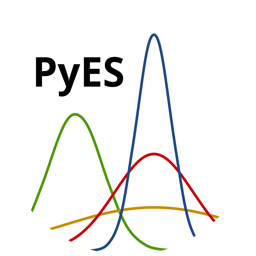

<p align="center">



# PyES
</p>

**Article:** [PyES – An open-source software for the computation of solution and precipitation equilibria](https://doi.org/10.1016/j.chemolab.2023.104860 "PyES Article")

PyES is a sotware created by the chemistry department of the University of Turin in collabration with the University of Messina and the University of Bialystok.

Based on the previous work of Professor Sammartano of the University of Messina, PyES aims to empower researchers with the ability to easily compute species distribution and simulate titration curves even for complex systems containing preciptiable species.

---

## Requirements
* Architecture:
  * x86_64
  * Apple Silicon
* OS:
  * Windows 10+
  * macOS 10.14+
  * Linux/X11 (Ubuntu 20.04+)

## Installation
1. Download the appropriate installer for your distribution from the [Release Page](https://github.com/Kastakin/PyES/releases/latest "Latest PyES Release")
2. Follow your OS specific instructions:
   * **Windows**:
      1. Double click on the downloaded `.exe` installer
      2. If prompted with the request of giving permissions to modify your system click "Yes"[^1]
      3. Follow the installation instructions
   * **macOS**:
        1. Double click on the downloaded `.dmg` file
        2. If the OS blocks the file from opening follow the [official instructions to open unsigned applications](https://support.apple.com/guide/mac-help/open-a-mac-app-from-an-unidentified-developer-mh40616/mac)[^1]
        3. Move the PyES icon to the Aplications folder
   * **Ubuntu**:
        1. Open a terminal
        2. Execute `sudo apt install path_to_deb_file` where `path_to_deb_file` points to the downloaded `.deb` file on you system

## Usage

A [User Manual](https://raw.githubusercontent.com/Kastakin/PyES/master/docs/user_manual/user_manual.pdf "PyES User Manual") containing examples and a detailed description of the interface is available in PDF format.

## How to Cite
If you use PyES in your work please cite our work as follows:
```
@article{CASTELLINO2023104860,
title = {PyES – An open-source software for the computation of solution and precipitation equilibria},
journal = {Chemometrics and Intelligent Laboratory Systems},
volume = {239},
pages = {104860},
year = {2023},
issn = {0169-7439},
doi = {https://doi.org/10.1016/j.chemolab.2023.104860},
url = {https://www.sciencedirect.com/science/article/pii/S0169743923001107},
author = {Lorenzo Castellino and Eugenio Alladio and Stefano Bertinetti and Gabriele Lando and Concetta {De Stefano} and Salvador Blasco and Enrique García-España and Sofia Gama and Silvia Berto and Demetrio Milea}
}
```

[^1]: For the time being we are not able to sign our installers, this might prompt with some security alerts on Windows and macOS. Our software does not execute any code whose purpose is other then solving solution and precipation equilibria.
